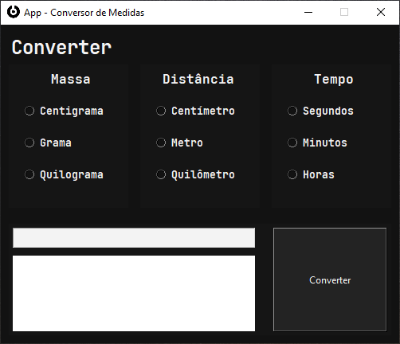
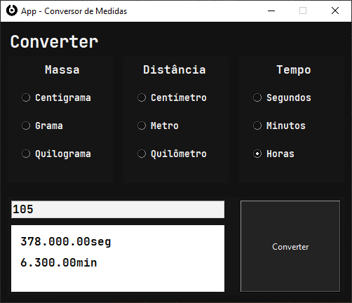

# Python App Conversor de unidades

App Feito para que, o usuário possar converter algumas unidades de medidas

## Modo de usar

-   Selecione algumas das opções

    

-   Digite o valor que queira converter

    

-   A medida selecionada indicará o valor que você estará convertendo
